# ゲームプレイ

## BP

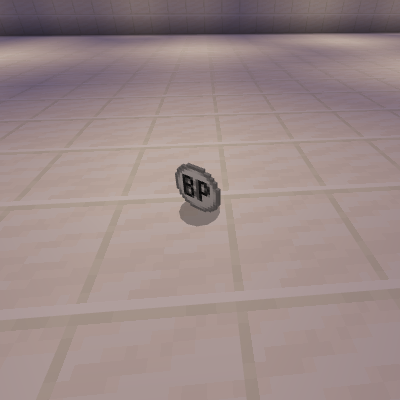

この世界では、人々は BP を求めて、日夜探求をしています。  
BP が発見されて以来、その良さを知る人々の間で広がり始め、
今や日常生活で利用されるまでに至りました。

### 用途

典型的には、BP は「ふりかける」ことで利用されます。  
例えば、小麦に BP をふりかけると稲が得られます。

| 材料 | クラフトのレシピ |
|-|-|
| BP + 小麦 (Wheat) | 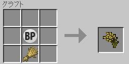 |

対象アイテムの一覧:

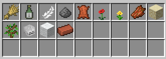

- 小麦 (Wheat)
- 命の水 (Water of Life)
- 羽根 (Feather)
- 火薬 (Gunpowder)
- 革 (Leather)
- 花 (Flower)
- 腐った肉 (Rotten Flesh)
- 砂岩 (Sandstone)
- 苗木 (Sapling)
- Mob の頭 (Mob Head)
- 羊毛 (Wool)
- レンガ (Brick)

## 稲 (Sheaf of Rice)

### 入手

| 材料 | クラフトのレシピ |
|-|-|
| 小麦 (Wheat) + BP |  |

米を栽培して収穫することで入手することもできます。

## 米 (Rice)

### 入手

稲を脱穀機にかけることで入手できます。

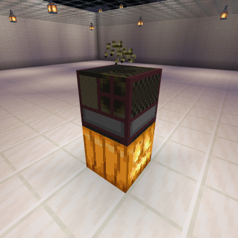

米を耕した土に植えて、栽培することができます。

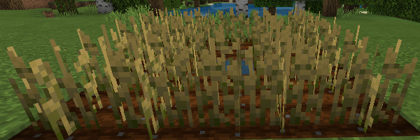 |

## 米飯 (Cooked Rice)

### 入手

米を炊くことで得られます。

| 材料 | かまどのレシピ |
|-|-|
| 米 (Rice) | 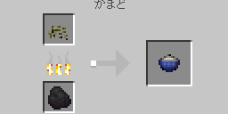 |

## 親子丼 (Oyakodon)

### 入手

| 材料 | クラフトのレシピ |
|-|-|
| 卵 (Egg) + 鶏肉 (Chicken) + 米飯 (Cooked Rice) | 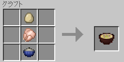 |

## 寿司 (Sushi)

### 入手

| 材料 | クラフトのレシピ |
|-|-|
| 生魚 (Raw Fish)1 + 米飯 (Cooked Rice) + 酢 (Vinegar)+ 砂糖 (Sugar)| 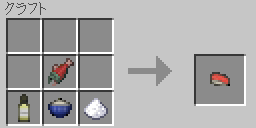 |

1 生鮭 (Raw Salmon)、生鱈 (Raw Cod)、フグ (Pufferfish)

## 命の水 (Water of Life)

### 入手

| 材料 | クラフトのレシピ |
|-|-|
| 米 (Rice) + 水入り瓶 (Water Bottle)| 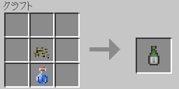 |

## 酢 (Vinegar)

### 入手

| 材料 | クラフトのレシピ |
|-|-|
| BP + 命の水 (Water of Life)| 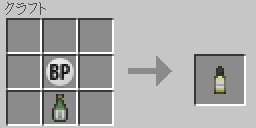 |

## 米俵 (Rice bag)

米俵は、この世界で生き残るための武器となるでしょう。

### 入手

| 材料 | クラフトのレシピ |
|-|-|
| 稲 (Sheaf of Rice) + 米 (Rice)| 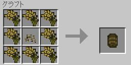 |

## BP 製造機 (BP Maker)

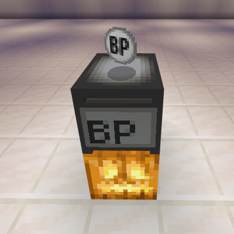

世界的な BP 需要に応えるため、BP 製造機が開発されました。  
かつては職人技術によって、BP の生産が行われていました。
BP 製造機の登場によって、大量生産が可能になりました。

### 入手

| 材料 | クラフトのレシピ |
|-|-|
| 鉄ブロック (Block of Iron) + 鍛冶台 (Smithing Table) + oO ストーン (oO Stone) | 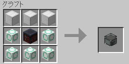 |

### 振る舞い

- 以下のアイテムを、BP 製造機の上に置くか、右クリックして使用すると、BP に変換します。
  - 土 (Dirt)
  - 丸石 (Cobblestone)
  - 花崗岩 (Granite)
  - 閃緑岩 (Diorite)
  - 安山岩 (Andesite)
  - 砂 (Sand)
  - 砂利 (Gravel)

- BP 製造機の上に置かれたアイテムは、スタック数にかかわらず、1 BP に変換します。

- ジャック・オ・ランタンを下に置くと、その方向にアイテムを運搬します。

## 脱穀機 (Threshing Machine)

### 振る舞い

- 稲を脱穀機の上に置くか、右クリックして使用すると、米に変換します。

- 脱穀機の上に置かれた稲は、スタック数にかかわらず、1 つの米に変換します。

- ジャック・オ・ランタンを下に置くと、その方向にアイテムを運搬します。

### 入手

| 材料 | クラフトのレシピ |
|-|-|
| 鎖 (Chain) + 鍛冶台 (Smithing Table) + oO ストーン (oO Stone) | 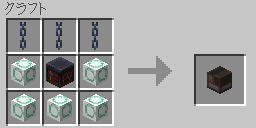 |

## P 駆動型コンベヤ (P-driven Conveyor)

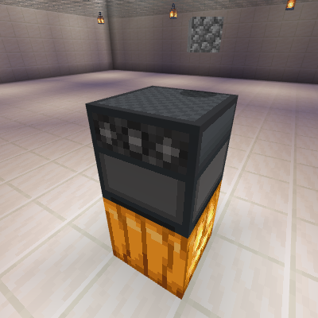

### 振る舞い

- ジャック・オ・ランタンを下に置くと、その方向にアイテムを運搬します。

### 入手

| 材料 | クラフトのレシピ |
|-|-|
| 竹 (Bamboo) + 鍛冶台 (Smithing Table) + oOCo ストーン (oOCo Stone) | 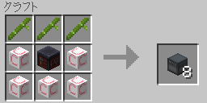 |

## P 駆動型リフター (P-driven Lifter)

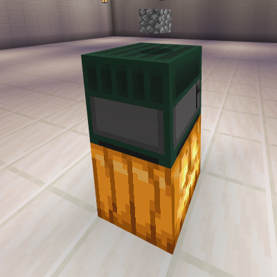

### 振る舞い

- ジャック・オ・ランタンを下に置くと、その方向にアイテムを 1 ブロック分持ち上げて運搬します。

### 入手

| 材料 | クラフトのレシピ |
|-|-|
| 鉄格子 (Iron Bars) + 鍛冶台 (Smithing Table) + oO ストーン (oO Stone) | 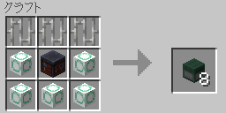 |

## 生物の oO

 |

### ドロップ

- oO ストーン (oO Stone)
- 竹 (Bamboo)

### 好物

米が好物です。

生物の oOCo とパートナーになり子を産みます。

### スポーンエッグ

| 材料 | クラフトのレシピ |
|-|-|
| 卵 (Egg) + 米 (Rice)| 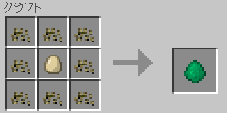 |

## 生物の oOCo

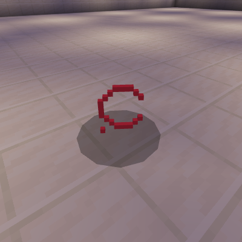 |

### ドロップ

- oOCo ストーン (oOCo Stone)
- 骨粉 (Bone Meal)

### 好物

米が好物です。

生物の oO とパートナーになり子を産みます。

### スポーンエッグ

| 材料 | クラフトのレシピ |
|-|-|
| 卵 (Egg) + 米 (Rice)| 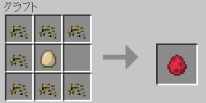 |
