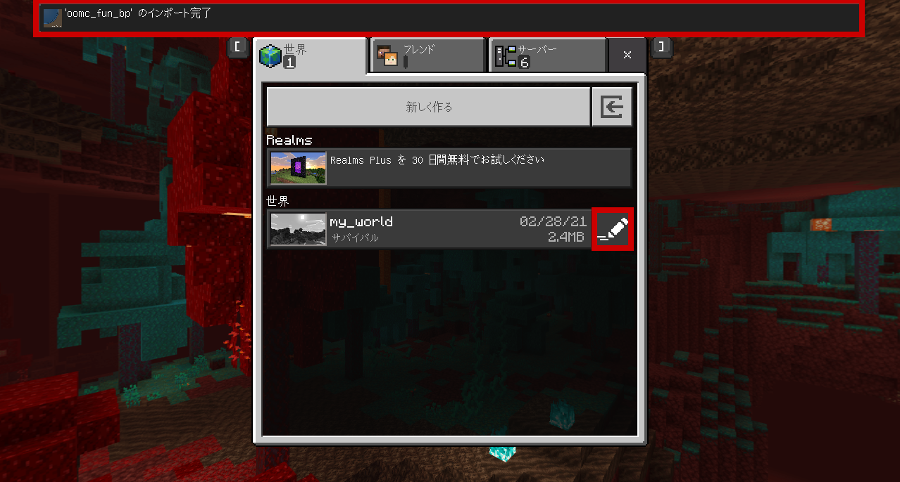
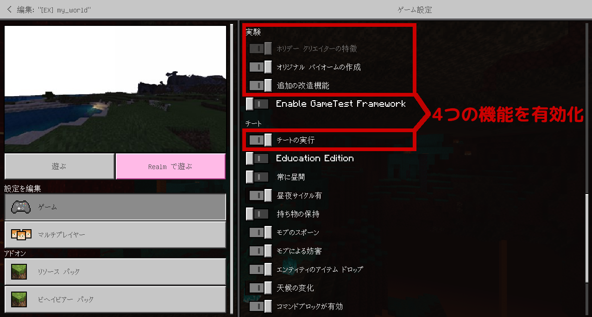
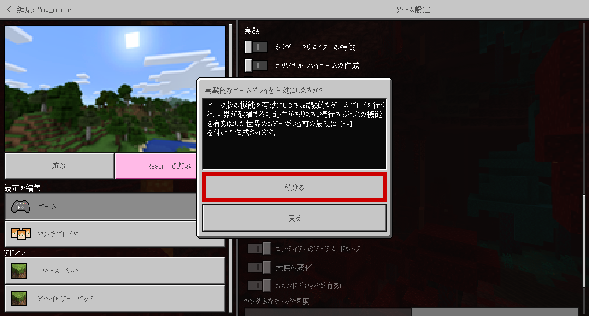
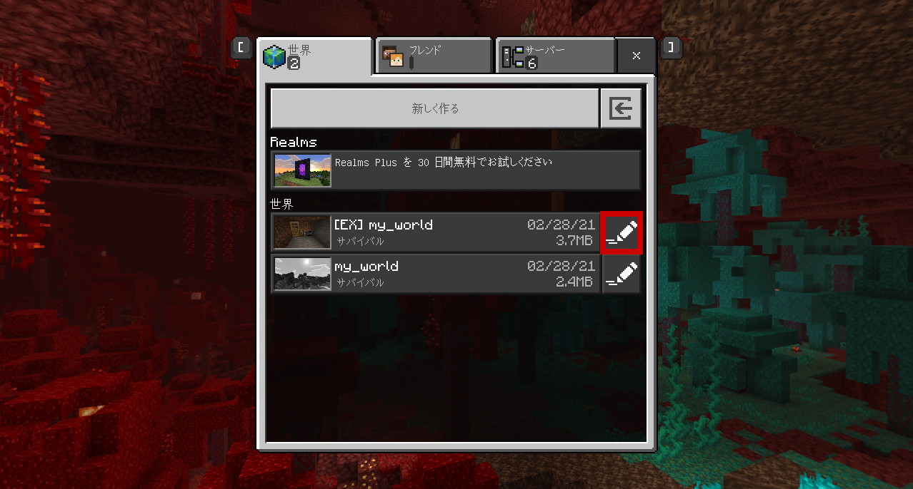
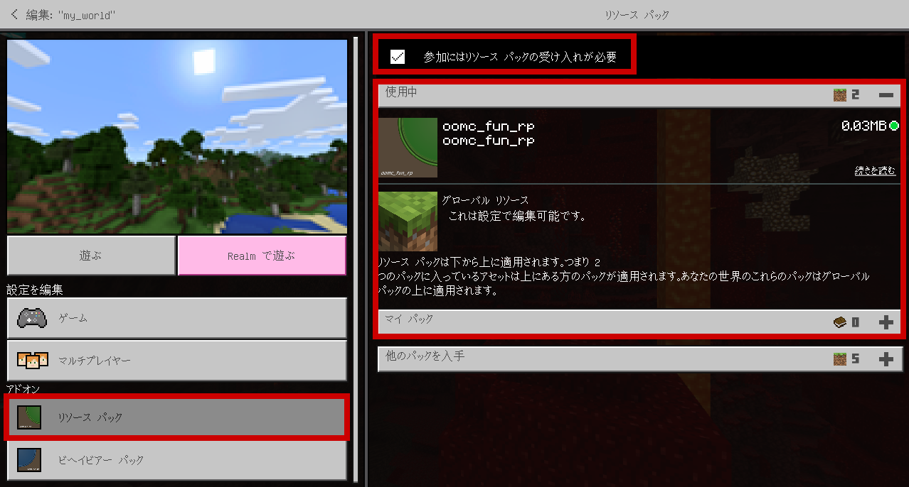

# アドオンのセットアップ

1. [Releases](https://github.com/oocytanb/oomc_fun/releases) から、最新版をダウンロードします。

1. ダウンロードした `oomc_fun_x.x.x.mcaddon` を実行して、インポートします。
  
  

1. 既存の世界で利用する場合は、コピーを取ったうえで作業します。

1. ゲームの設定から、「ホリデー クリエイターの特徴」「オリジナル バイオームの作成」「追加の改造機能」「チートの実行」を有効にします。  
  
  Turn on "Holiday Creator Features", "Creation of Custom Biomes", "Additional Modding Capabilities" and "Cheats".

1. 既存の世界で、初めて機能を有効にしようとすると、"[EX]" という名前を追加してコピーが作成されます。
  

1. "[EX]" という名前でコピーが作成された場合は、そちらで設定を続けます。
  

1. インポートしたアドオンを有効にします。  
  リソース パックの `oomc_fun_rp` を有効にします。
  「参加にはリソースパックの受け入れが必要」も有効にします。
  

1. ビヘイビア パックの `oomc_fun_bp` を有効にします。
  
