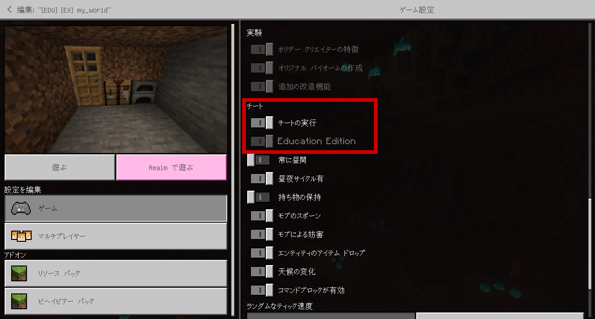
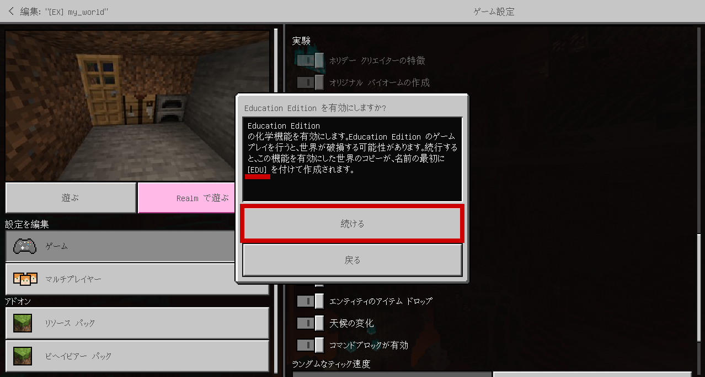
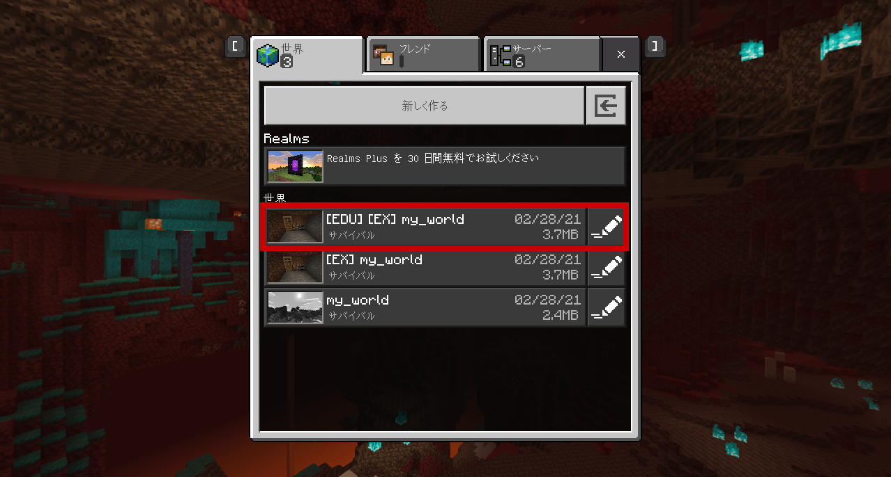

# Education Edition: Chemistry

## セットアップ

1. ゲームの設定から、「チートの実行」「Education Edition」を有効にします。  
  
  Turn on "Cheats" and "Education Edition".

1. 既存の世界で、初めて機能を有効にしようとすると、"[EDU]" という名前を追加してコピーが作成されます。
  
  

## 参考資料

- [CHEMISTRY IN MINECRAFT](https://education.minecraft.net/chemistry)
- [CHEMISTRY LAB JOURNAL](https://aka.ms/labjournal)
- [Elements](https://aka.ms/elementconstructor)
- [化合物](https://minecraft-ja.gamepedia.com/%E5%8C%96%E5%90%88%E7%89%A9)

## 化学実験アイテム

- 化合物作成器
- 物質還元器
- 元素構成器
- 実験テーブル

これらのアイテムは、クラフトでは作ることができません。  
サバイバルモードなどでは、`/give` コマンドで直接与える必要があります。

```
/give @s chemistry_table 1 2
/give @s chemistry_table 1 4
/give @s chemistry_table 1 8
/give @s chemistry_table 1 12
```
