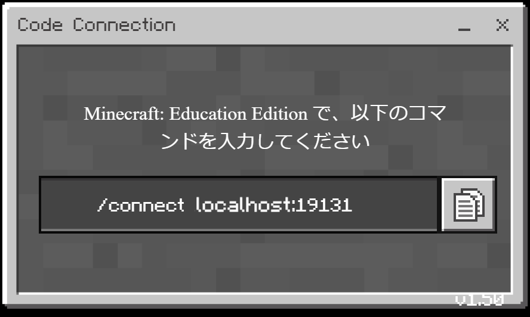
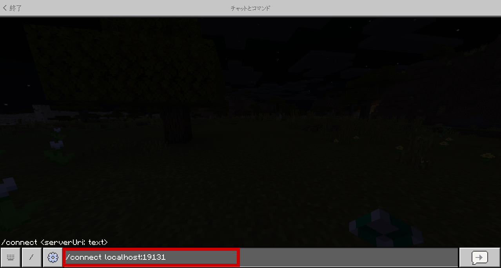
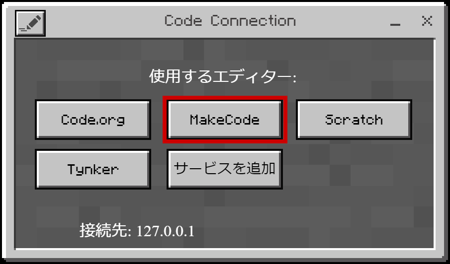
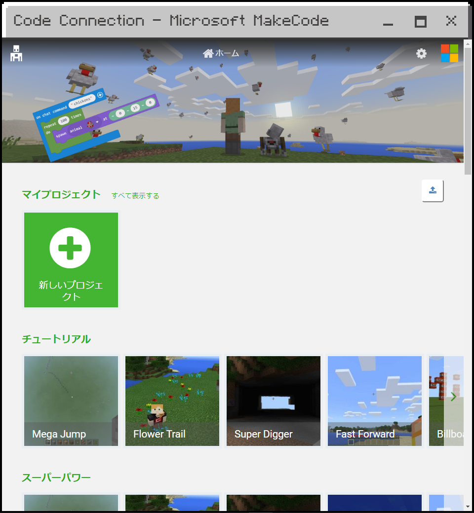
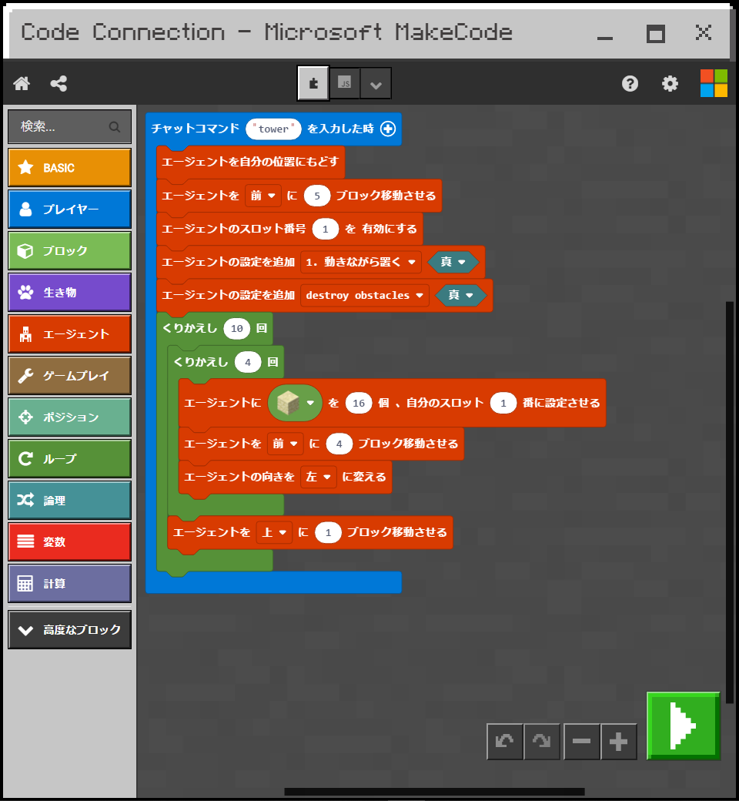

# Code Connection

Code Connection は、コードによって、ワールドにアクセスするための拡張機能です。  
ビジュアルプログラミングまたはテキストプログラミングを選ぶことができます。

## 参考資料

[Code Connection](https://minecraft-ja.gamepedia.com/Code_Connection)

## 導入方法

1. [Code Connection](https://www.microsoft.com/ja-jp/p/code-connection-for-minecraft/9ppfpg2fg2qb) のアプリをインストールします。

1. Code Connection を起動すると、接続するためのコマンドが表示されるので、コピーして、ゲーム内のチャットに貼り付けます。
  
  

1. 使用するエディターは、[MakeCode](https://minecraft.makecode.com/) を選択します。
  

1. ホーム画面から、チュートリアルプロジェクトなどを開くと、プログラミングを開始できます。
  
  
