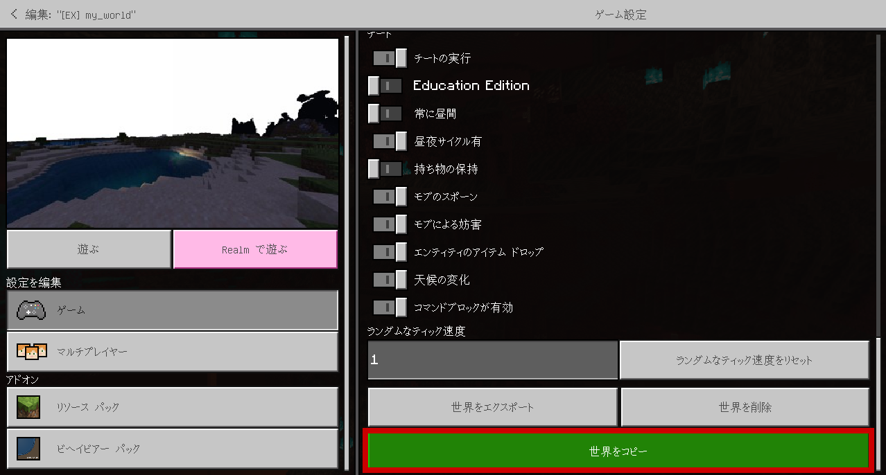
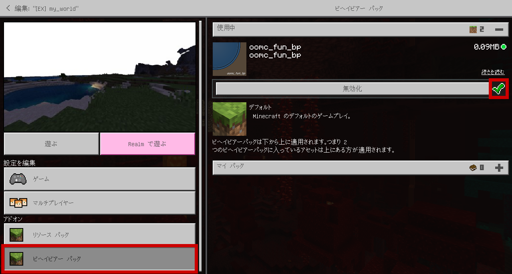
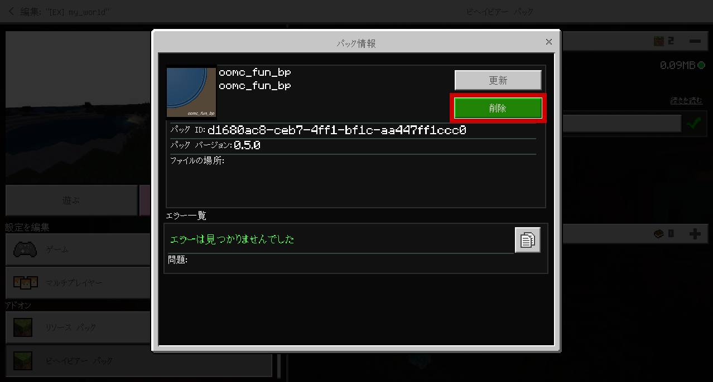
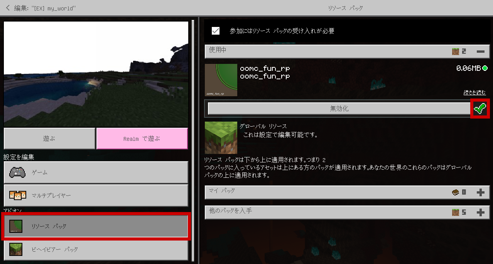
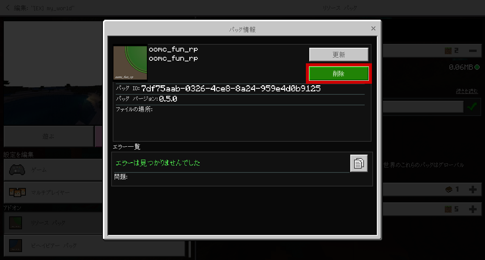
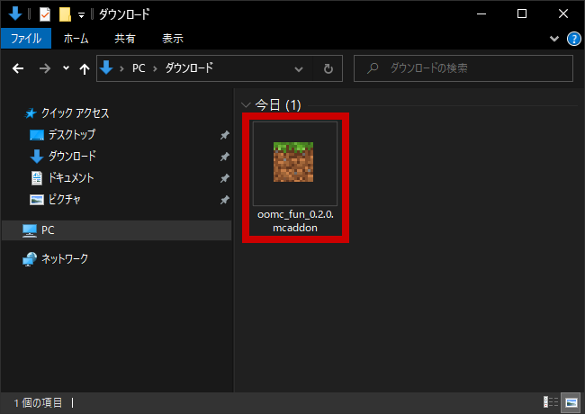
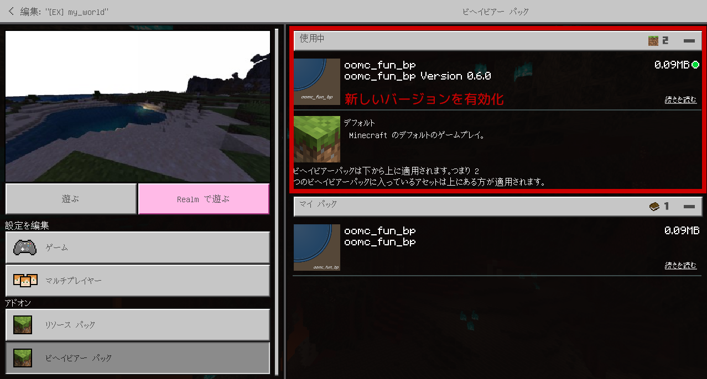
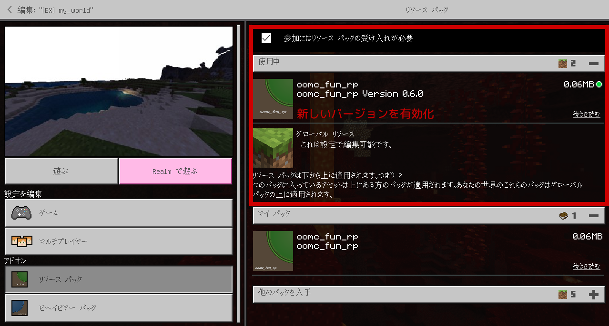

# アドオンの更新

1. 作業の失敗に備えて、既存の世界をコピーしたうえで作業します。
  

1. 古いバージョンのアドオンを無効化、または削除します。  
  ビヘイビア パックの `oomc_fun_bp` を無効化、または削除します。
  
  

1. リソース パックの `oomc_fun_rp` を無効化、または削除します。
  
  

1. 新しいバージョンの `oomc_fun_x.x.x.mcaddon` を実行して、インポートします。
  

1. ゲームの設定を開き直し、新しいバージョンのアドオンを有効化します。  
  ビヘイビア パックの `oomc_fun_bp` を有効化します。
  

1. リソース パックの `oomc_fun_rp` を有効化します。
  
